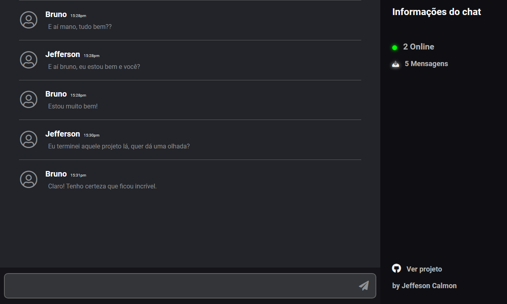

<div align="center">
    <h1>Chat em Tempo Real</h1>
    <p>Uma incrível sala de bate-papo online em tempo real.</p>
    
</div>


## :desktop_computer: Projeto

Plataforma de bate-papo criada com javascript, com o intuito de testar conhecimentos de desenvolvimento.

## :rocket: Tecnologias

- NodeJS

- Express

- Socket.io

- EJS

- JQuery

## :dart: Utilização

**[Acesse a plataforma web clicando aqui](https://talking-chat.herokuapp.com/)**

ou

### Rodar app localmente

- Clone este repositório com ```git clone https://github.com/jefferson-calmon/chat-real-time.git```

- Acesse a pasta do projeto com cd ```chat-real-time```

- Instale as dependências do projeto com ````npm install```

- Inicie o servidor local com ```node server.js```

- Acesse ```http://localhost:4000``` em seu navegador e divirta-se!

## :thinking: Como contribuir

- Faça um fork desse repositório;
- Cria uma branch com a sua feature;
- Faça commit das suas alterações;
- Faça push para a sua branch;

Depois que o merge da sua pull request for feito, você pode deletar a sua branch.

## :technologist: Dev

Jovem apaixonado por programação e desenvolvimento, Jefferson ferrari é um desenvolvedor front-end.


[Portfólio](https://jefferson-calmon.github.io)

[Linkedin](https://www.linkedin.com/in/jefferson-f-b24248191/)

[Instagram](https://instagram.com/jeffz1_)

---

Build with :heart: